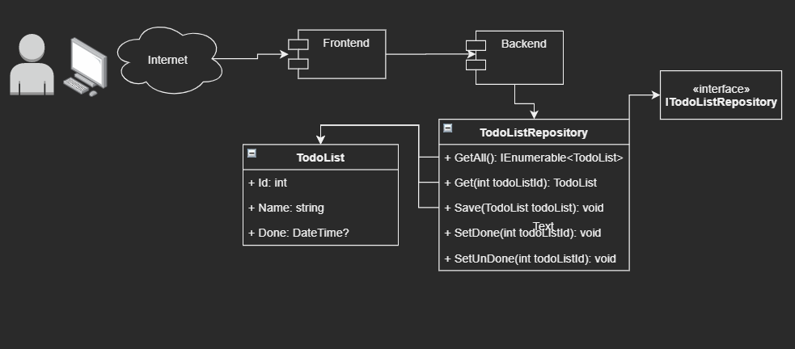

# Awesome todo list
Todo list completo usando dotnet core (C#) e Angular com sqlite.

## Overview

## Conceitos
- Repository pattern

## Backend
### Requerimentos
- [.NET Core 3.1 SDK](https://dotnet.microsoft.com/download/dotnet-core/3.1)

### Rodando o backend
- `cd backend/AwesomeTodoList/`
- `dotnet run`

## Frontend
### Requerimentos
- [Node.js](https://nodejs.org/en/download/)

### Rodando o backend
- `npm install`
- `cd frontend/awesome-todo-list/`
- `ng serve`

Abrir no navegador http://localhost:4200/ o projeto backend
